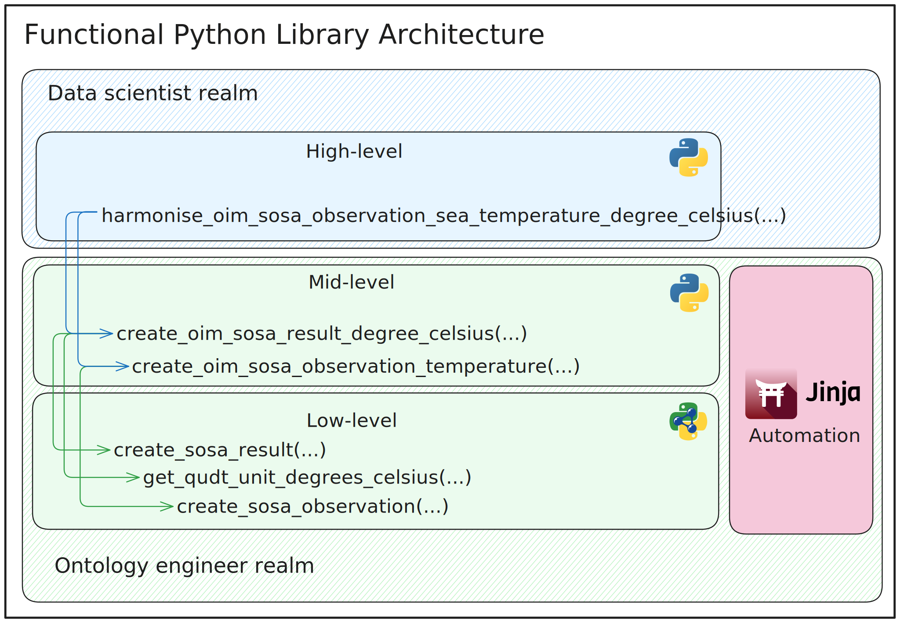
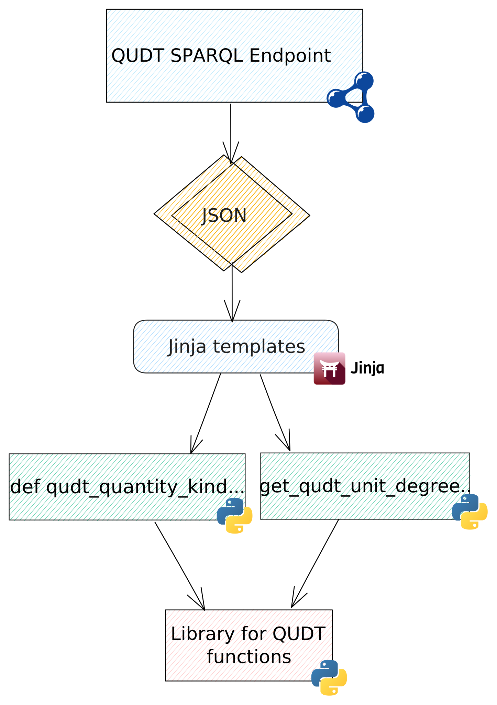
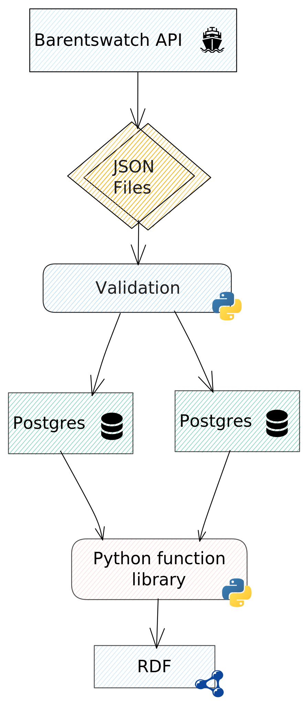

# A Pythonic Functional Approach for Semantic Data Harmonisation in the ILIAD Project

This repository contains a simplified implementation and examples for the paper:

> **“A Pythonic Functional Approach for Semantic Data Harmonisation in the ILIAD Project”**  
> *Erik Johan Nystad and Francisco Martín-Recuerda, SINTEF Digital, Oslo, Norway*  
> *(Submitted to ESWC 2026)*

The code demonstrates how to encode ontology design patterns from OIM, SOSA, and QUDT as **composable Python functions**, enabling data scientists to generate correct RDF with simple function calls in their usual Python workflows.

# Requirements

**Using uv (recommended):**
```bash
uv sync
```

**Using pip:**
```bash
pip install -r requirements.txt
```

# Development

Install with dev dependencies:
```bash
uv sync --extra dev
```

Set up pre-commit hooks (auto-runs ruff on commit):
```bash
uv run pre-commit install
```

Lint and format code manually:
```bash
uv run ruff check --fix .
uv run ruff format .
```

# Simplified ILIAD Data Harmonisation Pipeline
This repository includes a simplified version of the ILIAD data harmonisation pipeline implemented as a Jupyter Notebook: `iliad_harmonisation_pipeline.ipynb`. The example in the notebook shows how data scientists can interact with high-level functions to harmonise sea temperature measurements. To use the Notebook, execute the following command:

```bash
uv run jupyter notebook iliad_harmonisation_pipeline.ipynb
```

# Python script for data harmonisation
This Python script `main.py` demonstrates the same sea temperature harmonisation example as in the Jupyter Notebook. To run the script, execute the following command:

```bash
uv run python main.py
```

# Jinja Automation for Code Generation
This repository also includes a lightweight Jinja + SPARQL pipeline to automatically generate Python functions for QUDT units and quantity-kinds. The code generation pipeline is located in the `jinja_automation/` directory. To run the code generation pipeline, execute the following command:

```bash
uv run python update_library.py
```

This will query the QUDT ontology using SPARQL and generate the corresponding Python functions in the `ontology_library/low_level_functions/` directory.

## Functional Hierarchy and Repository Structure

This repository follows a **three-layer functional architecture** for semantic data harmonisation.  
The directory structure mirrors this design.

---

### 1. **Low-level functions**  
**Directory:** `ontology_library/low_level_functions/`

Small building blocks that wrap **RDFLib** and **OWL** primitives.  
They provide:
- IRI constructors for SOSA/OIM  
- Triple-adding utilities  
- Auto-generated QUDT unit and quantity-kind functions (`qudt_unit_functions.py`, `qudt_quantity_kind_functions.py`)

These files are partly generated by the Jinja/SPARQL pipeline.

---

### 2. **Mid-level functions (ontology templates)**  
**Directory:** `ontology_library/mid_level_functions/`

Reusable **ontology design patterns** implemented in Python.  
Example: `mid_level_observation_functions.py` defines templates for:
- SOSA Observation  
- SOSA Result  
- QUDT QuantityValue  

They implement reusable modelling templates while delegating triple construction to the low-level layer.

---

### 3. **High-level functions (domain-specific workflows)**  
**Directory:** `ontology_library/high_level_functions/`

User-facing functions that implement complete harmonisation workflows.  
Example: `high_level_observation_functions.py` contains the function for transforming sea temperature measurements into OIM-aligned SOSA/QUDT RDF.

---




## Code Generation (Jinja + SPARQL)

**Directory:** `jinja_automation/`

A lightweight pipeline that:
- Queries QUDT using SPARQL (`sparql_queries/`)
- Renders Python wrappers with Jinja (`jinja_templates/`)
- Updates the library via `update_library.py`

This keeps QUDT-related functions up-to-date automatically.



---

## Real-World Use Case: Barentswatch Pipeline

The following diagram shows how the Python function library integrates into a real-world data harmonisation pipeline, fetching data from the Barentswatch API and producing validated RDF stored in PostgreSQL.



---

## Additional Files

- `main.py` – Example entry point showing how to run high-level harmonisation.
- `iliad_harmonisation_pipeline.ipynb` – Notebook version of the ILIAD pipeline for interactive exploration.
- `data/sea_temp.json` – Example dataset used in the harmonisation example.
- `output/*.ttl` – RDF outputs generated by the pipeline.
- `ontology_library/utils.py` – Helper utilities (namespace binding, function name sanitization).
- `ontology_library/constants.py` – RDF namespace definitions.

---

## Reference

This repository contains the code accompanying the paper:

**Erik Johan Nystad and Francisco Martín-Recuerda.  
*A Pythonic Functional Approach for Semantic Data Harmonisation in the ILIAD Project.*  
Submitted to ESWC 2026.**
